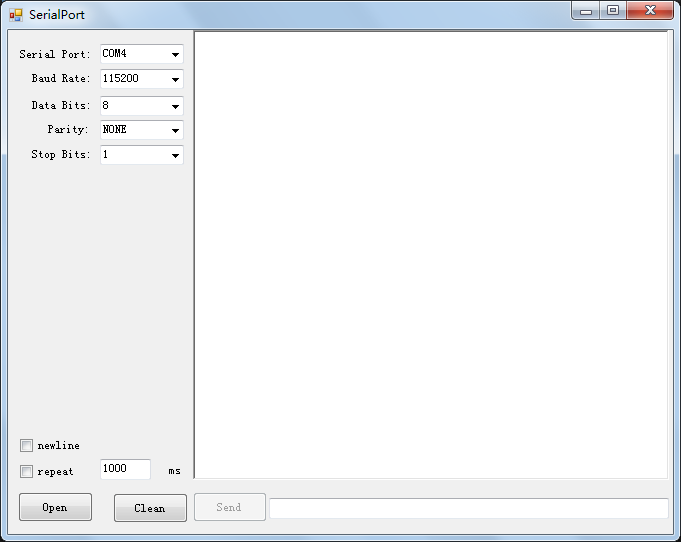

# SerialPortW

##### version 1.1

在原来的基础上增加奇偶校验，数据位选择，停止位选择等。

##### version 1.2

更改布局，添加端口冲突检测。

##### version 1.3

- 添加定时发送功能。

- 发送数据末尾是否添加enter('\n')选择。

- 接受框更改为RichTextBox，原来是TextBox。

- 更改布局，添加端口冲突检测。

